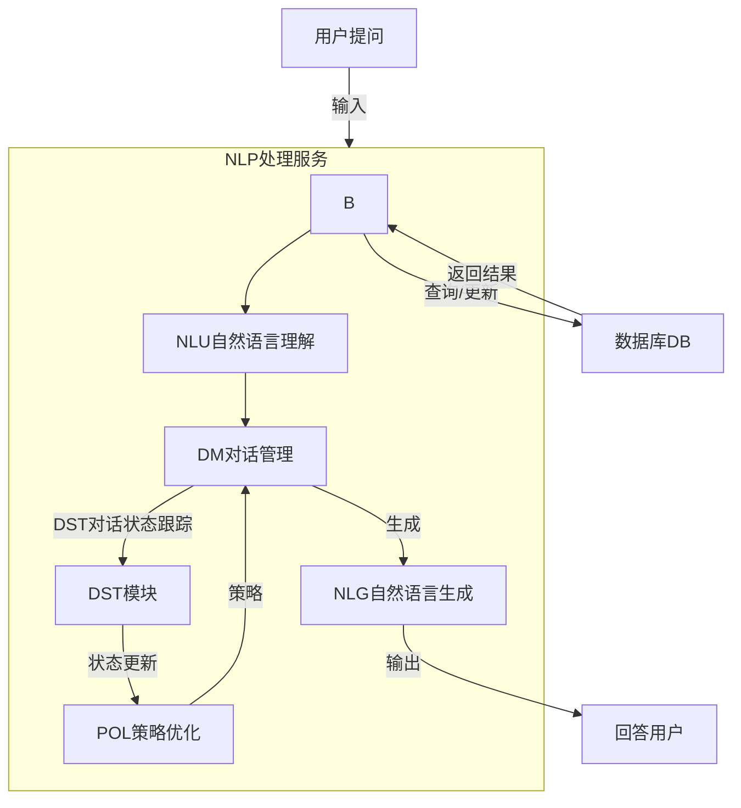

# nlp-dialog
一个基于python的简单对话系统
## 对话交互流程


## 目录结构
```
dialog-system/
├── README.md             # 仓库的说明文件，包含项目介绍、使用指南等
├── requirements.txt      # 项目依赖项列表（如果是Python项目）
├── environment.yml       # 项目环境配置文件（如果是使用Conda的环境）
├── data/                 # 数据目录，包含训练数据、模型权重等
│   ├── corpus/           # 对话语料库，可以是文本文件、JSON文件等
│   ├── models/           # 训练好的模型文件
│   └── preprocess/       # 数据预处理脚本和结果
├── src/                  # 源代码目录
│   ├── __init__.py       # 使src目录成为Python包
│   ├── agents/           # 对话代理（或称为机器人）的实现
│   │   ├── __init__.py
│   │   ├── chatbot.py    # 聊天机器人的主实现文件
│   │   └── ...           # 其他代理实现
│   ├── nlp/              # 自然语言处理模块
│   │   ├── __init__.py
│   │   ├── tokenizer.py  # 分词器
│   │   ├── intent_recognition.py  # 意图识别模块
│   │   ├── entity_extraction.py   # 实体提取模块
│   │   └── ...           # 其他NLP任务
│   ├── utils/            # 工具函数和脚本
│   │   ├── __init__.py
│   │   ├── logging_config.py  # 日志配置
│   │   ├── file_utils.py      # 文件操作工具
│   │   └── ...               # 其他工具
│   └── api/                # API接口实现（如果有Web服务或RESTful API）
│       ├── __init__.py
│       ├── app.py           # Flask/Django等Web框架的主文件
│       └── ...              # 其他API实现
├── tests/                  # 测试目录
│   ├── __init__.py
│   ├── test_chatbot.py     # 聊天机器人的测试用例
│   ├── test_nlp.py         # NLP模块的测试用例
│   └── ...                 # 其他模块的测试用例
├── config/                 # 配置文件目录
│   ├── settings.py         # 主配置文件
│   └── ...                 # 其他配置文件（如数据库配置、API密钥等）
├── scripts/                # 脚本目录，包含运行系统、训练模型等的脚本
│   ├── train_model.py      # 训练模型的脚本
│   ├── run_server.py       # 运行Web服务的脚本
│   └── ...                 # 其他脚本
└── .gitignore              # Git忽略文件，指定不提交到仓库的文件和目录
```